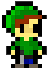
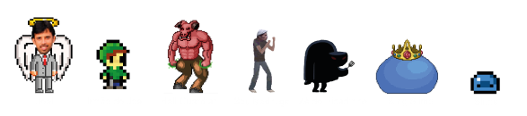
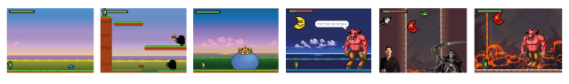

# Brother of Joel ⚔️

Projeto feito para disciplina de Introdução a programação do CEFET-RJ no ano letivo de 2020. 

## Sinopse 📖

O irmão do Joel quer se vingar pela morte de seu irmão e acaba em uma aventura em busca da criatura que o matou. Com tantos desafios pela frente, será que ele chegará em seu objetivo? Que tipos de monstros ele encontrará em sua jornada? Tente chegar até o final e descubra o segredo do BROTHER OF JOEL!

>  **Link para o [jogo](https://scratch.mit.edu/projects/499562882) no Scratch**

## 💻 Sobre o projeto
  
Brother of Joel é inspirado no desenho [irmão do Jorel](https://www.cartoonnetwork.com.br/show/irmao-do-jorel) e no professor da disciplina de introdução a programação, cujo trabalho era a criação do jogo.  
Feito no scratch😺, o jogo tem seu design todo em pixel art👾 e contém vários 'easter eggs' de diversos desenhos, filmes, séries e jogos.  
🏆🥇 Foi eleito o melhor da turma e melhor na escolha do professor - [site da premiação](https://eic.cefet-rj.br/~jsantos/classes/introducao-a-programacao-2020/?lang=pb).  

### **Personagens**🎨

### 🌛🌜**Fases**

## 💻 Desenvolvedores:

- 👨🏻‍💻 ERIC BARBOSA CASTELLAR PINHEIRO; 
- 👨🏿‍💻 ERICK SILVA DE ALMEIDA; 
- 👩🏻‍💻 RAFAELA BEZERRA DE FIGUEIREDO; 
- 👨🏻‍💻 VICTOR PINHEIRO PALMEIRA. 

## 💡 Professor e inspiração para o jogo:

- 👨🏻‍🏫 JOEL ANDRE FERREIRA DOS SANTOS.